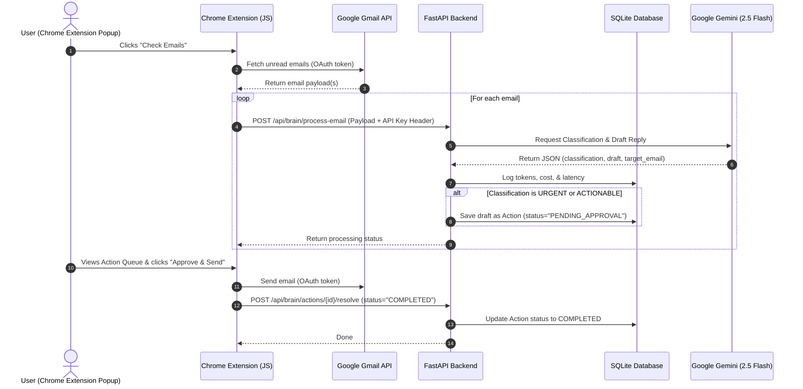

# Personal Operations Agent

An intelligent, human-in-the-loop personal assistant designed to manage Gmail and Google Calendar workflows. Built with a focus on observability, transparency, and cost-control, the system ensures that the user is always in control of any state-mutating actions (like sending emails or booking events).

---

## 🚀 Key Highlights & Architectural Mandates

This project is built from the ground up to demonstrate the best practices of AI engineering:

1. **The "Do Not Send" Mandate (Human-in-the-Loop)**
   The agent autonomously reads incoming emails, classifies them, and drafts replies. However, it can **never** execute a state-mutating action (e.g., sending an email) without explicit human approval. Action proposals are saved to the database with a status of `PENDING_APPROVAL` and are resolved only when approved by the user through the Chrome Extension UI.
2. **The Logging & Observability Mandate**
   Every single call to the LLM goes through a custom wrapper that tracks `prompt_tokens`, `completion_tokens`, `latency_ms`, and calculates `total_cost`. These metrics are logged directly into an SQLite database.
3. **Transparency over Abstraction**
   Instead of using black-box agentic frameworks (like LangChain or AutoGen), this project implements a transparent custom Python loop/state-machine. This allows for fine-grained logging, easier debugging, and absolute control over prompt execution.
4. **Bring Your Own Key (BYOK)**
   To ensure privacy and scalability, the Gemini API key is not hardcoded or stored on the backend. The user inputs their key in the Extension settings, which is sent securely to the FastAPI backend via the `X-Gemini-Api-Key` HTTP Header.

---

## 🛠️ Tech Stack

*   **Frontend**: Chrome Extension (Manifest V3, JavaScript, HTML, CSS)
    *   Uses Chrome's `chrome.identity` API for secure Google OAuth2 authentication.
    *   Directly interacts with Google APIs (e.g., Gmail API) using the user's OAuth token.
*   **Backend**: Python (FastAPI, Uvicorn, Python-dotenv)
    *   Exposes endpoints to process emails, manage the queue of pending actions, and log LLM metrics.
*   **LLM**: Google Gemini via the new `google-genai` SDK.
    *   Uses the `gemini-2.5-flash` model for fast, cost-effective classifications and drafts.
*   **Database**: SQLite (SQLAlchemy ORM)
    *   Stores pending/resolved actions, fetched email details, and LLM logs.

---

## 📐 Architecture & System Flow

The diagram below outlines the interaction between the Chrome Extension, the FastAPI Backend, and external services (Google APIs & Gemini):



---

## 📂 Project Structure

```text
├── chrome-extension/         # Chrome Extension (Frontend)
│   ├── background.js         # Service worker handling email fetching
│   ├── popup.html            # Extension popup user interface
│   ├── popup.js              # Popup logic: OAuth, actions queue, approval flows
│   └── manifest.json         # Extension manifest (v3) config
├── core/
│   └── llm_wrapper.py        # Gemini Client wrapper with cost and token logging
├── db/
│   ├── database.py           # SQLite connection and session maker
│   └── models.py             # ORM models (User, Email, Action, LLMLog)
├── routers/
│   └── brain.py              # API routes (/process-email, /pending-actions, /resolve)
├── main.py                   # FastAPI main entry point
├── requirements.txt          # Python dependencies
├── GEMINI.md                 # Internal instruction manual for the AI agent
├── Prompt_Contract.md        # Prompt contract defining the success/failure spec
└── Skills/                   # Guides on OAuth, custom agent loops, and prompting
```

---

## ⚙️ Getting Started & Setup

### Prerequisites
1. **Google Cloud Console Project**:
   *   Enable the **Gmail API** (and **Google Calendar API** if extending calendar functionalities).
   *   Set up the **OAuth Consent Screen** (external/internal testing mode).
   *   Create **OAuth 2.0 Client IDs (Web application)**.
   *   Add Authorized redirect URIs: `http://localhost:8000/auth/callback` (or your production URL).
2. **Gemini API Key**: Obtain one from [Google AI Studio](https://aistudio.google.com/).

### Backend Setup
1. Clone the repository and navigate to the project directory:
   ```bash
   cd Personal-Agent
   ```
2. Create and activate a Python virtual environment:
   ```bash
   python -m venv venv
   # On Windows (PowerShell):
   .\venv\Scripts\Activate.ps1
   # On macOS/Linux:
   source venv/bin/activate
   ```
3. Install the dependencies:
   ```bash
   pip install -r requirements.txt
   ```
4. Start the FastAPI development server:
   ```bash
   uvicorn main:app --reload
   ```
   The backend will be running at `http://localhost:8000`. The database tables in `personal_agent.db` will be initialized automatically.

### Frontend Setup (Chrome Extension)
1. Open Google Chrome and go to `chrome://extensions/`.
2. Enable **Developer mode** (toggle in the top-right corner).
3. Click **Load unpacked** in the top-left corner.
4. Select the `chrome-extension` folder inside this repository.
5. Once loaded, click the extension icon to open the popup:
   *   Enter your **Gemini API Key** and click **Save Key**.
   *   Click **Login with Google** to authenticate with your Gmail/Calendar account.
   *   Select a timeframe (e.g., `1d` for last 1 day) and click **Check Emails** to start processing unread emails.

---

## 📈 Observability & Database

All actions and LLM logs are stored in `personal_agent.db`.

### LLM Metrics Log Schema
The `llm_logs` table records statistics for every generation:
*   `prompt_tokens`: Number of tokens in the input prompt.
*   `completion_tokens`: Number of tokens in the generated response.
*   `total_cost`: Estimated cost in USD (calculated using flash-pricing model rates).
*   `latency_ms`: Duration of the API call in milliseconds.
*   `model_name`: The Gemini model used (e.g., `gemini-2.5-flash`).

### Action Workflow Status
Proposed actions are saved to `actions` with:
*   `PENDING_APPROVAL`: Created by the backend when an urgent/actionable email is received.
*   `COMPLETED`: Updated when the user approves and sends the email from the extension.
*   `REJECTED`: Updated when the user cancels the proposed action.
